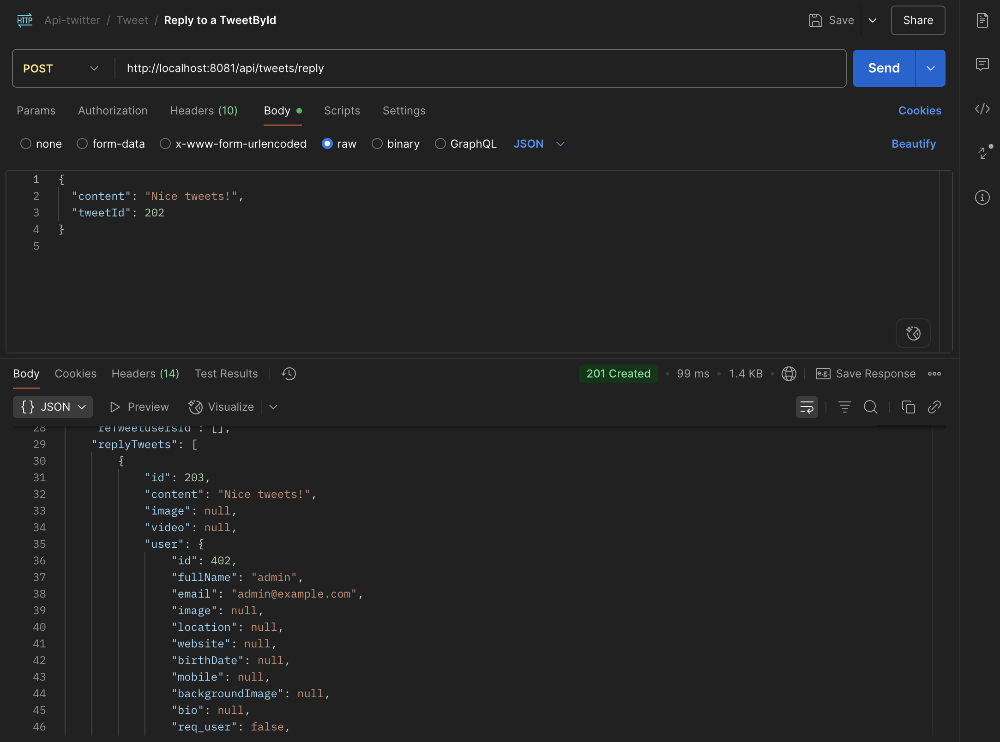

# Twitter Clone Backend – Spring Boot


A secure and scalable backend API built with Java Spring Boot that works like Twitter. It includes user registration, login with JWT, posting tweets, liking, and role-based access control. The project demonstrates clean architecture and RESTful API design.

---

## Features

- User registration & login with password hashing
- JWT-based stateless authentication
- Create and fetch tweets
  -️ Like and unlike tweets
- View user profiles
- Input validation and consistent error handling
- Layered architecture (Controller → Service → Repository)
- Modular DTO mapping
- Ready for unit and integration testing

---

## Project Structure

```
src/main/java/com/example/
├── controller/         # Handles HTTP requests
├── service/            # Business logic
├── repository/         # Database access
├── config/             # Security and app configuration
├── dto/mapper/         # Data transfer and mapping
├── exception/          # Custom error handling
└── util/response/      # Utility and response formatting
```

---

## Tech Stack

- Java 17
- Spring Boot 3.x
- Spring Security with JWT
- Spring Data JPA (H2/MySQL)
- Maven

---

## Getting Started

### Prerequisites

- Java 17+
- Maven 3.8+
- MySQL 5.7+ or 8.0+

### Installation

```bash
git clone https://github.com/deeleep/twitter-api.git
cd twitter-api
./mvnw spring-boot:run
```

---

### Configure Spring Datasource, JPA, App properties

Create a MySQL database named twitter_db and update the following in

```sql
CREATE DATABASE twitter_db;
```

Open `src/main/resources/application.properties`:

```properties
spring.datasource.url=jdbc:mysql://localhost:3306/twitter_db?useSSL=false
spring.datasource.username=root
spring.datasource.password=yourpassword

spring.jpa.properties.hibernate.dialect=org.hibernate.dialect.MySQLDialect
spring.jpa.hibernate.ddl-auto=update
```

---

## API Usage

### 1. Sign Up

**POST** `http://localhost:8080/api/auth/signup`

#### Example:


---

### 2. Sign In

**POST** `http://localhost:8080/api/auth/signin`

#### Example:


---

### 3. Create a Tweet

**POST** `http://localhost:8080/api/tweets/create`  
**Headers**:

```
Authorization: Bearer <token>
```

#### Example:


---

### 4. Reply to a Tweet

**POST** `http://localhost:8080/api/tweets/reply`  
**Headers**:

```
Authorization: Bearer <token>
```

#### Example:



---

### 5. Retweet by Other User

**POST** `http://localhost:8080/api/tweets/{tweetId}/retweet`

#### Example:


---

### 6. Get Tweet by Tweet ID

**GET** `http://localhost:8080/api/tweets/{tweetId}`

#### Example:


---

### 7. Get All Tweets by User ID

**GET** `http://localhost:8081/api/tweets/user/{userId}`

#### Example:


---

### 8. Get All Tweet Likes By UserId

**GET** `http://localhost:8080/api/tweets/user/{userId}/likes`

#### Example:


---

### 9. Delete Tweet by Tweet ID

**DELETE** `http://localhost:8080/api/tweets/{tweetId}`

**Headers**:

```
Authorization: Bearer <token>
```


---

### 10. Like a Tweet

**POST** `http://localhost:8080/api/{tweetId}/likes`

#### Example:


---

### 11. Get All Likes of Tweet

**GET** `http://localhost:8080/api/tweet/{tweetId}`

#### Example:


---

### 12. Get Own Profile

**GET** `http://localhost:8080/api/users/profile`

#### Example:


---

### 13. Get User by ID

**GET** `http://localhost:8080/api/users/{userId}`

#### Example:


---

### 14. Search User by Name and JWT Token

**GET** `http://localhost:8080/api/users/search?name={name}`  
**Headers**:

```
Authorization: Bearer <token>
```

#### Example:


---

### 15. Update User Details

**PUT** `http://localhost:8080/api/users/{userId}`  
**Headers**:

```
Authorization: Bearer <token>
```

#### Example:


### 16. Follow/UnFollow User

**POST** `http://localhost:8080/api/users/{userId}/follow`

#### Example:


---

### 17. Get Followed Users

**GET** `http://localhost:8080/api/users/{userId}/following`

#### Example:


---

### 18. Get User Followers

**GET** `http://localhost:8080/api/users/{userId}/followers`

#### Example:


---

## Sample Unit Test

```java
@Test
public void testRegisterUser() throws UserException {
    User user = new User();
    user.setEmail("test@example.com");
    user.setPassword("password123");

    User savedUser = userService.registerUser(user);

    assertNotNull(savedUser.getId());
    assertEquals("test@example.com", savedUser.getEmail());
}
```

---

## Testing

```bash
./mvnw test
```

---

## License

This project is licensed under the MIT License.
